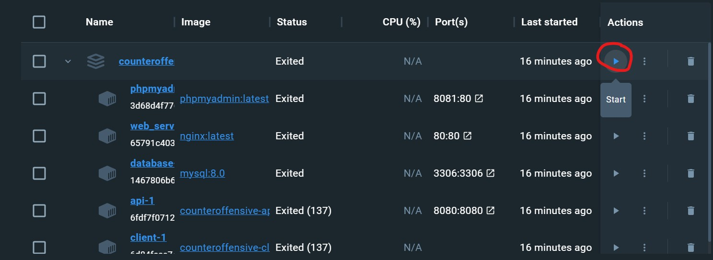

# Игра Контрнаступ (ContrNastup)
Браузерный 2д шутер про танки.
* [Доска заданий (Miro)](https://miro.com/app/board/uXjVMlZXLK0=/?share_link_id=267926727208)
* [Дизайн (Figma)](https://www.figma.com/file/o4i6tlpz45fEzdjZYZkoGu/Макеты?type=design&node-id=0%3A1&mode=design&t=LiBC4qdAeW1BguQ2-1)

## Оглавление
+ [Требуемые программы](#required-programs)
+ [Запуск проекта](#start)
+ [Сборка](#build)
+ [Запуск собранного проекта](#up)
+ [Перезапуск](#restart)
+ [Остановка](#stop)
+ [Лог](#log)
+ [Контейнеры](#containers)
+ [Как работать с репозиторием](#repo-guide)
+ [Внутренние ссылки](#inside-links)

<a name="required-programs"></a>
## Требуемые программы
* [Docker](https://docs.docker.com/desktop/install/windows-install/) и дополнение Docker Compose (на Windows идёт из коробки)
* [NodeJS](https://nodejs.org/en/download)

<a name="start"></a>
## Запуск проекта
Все команды нужно запускать в терминале в корневой папке проекта и при запущенном Docker Desktop

<a name="build"></a>
## Сборка (Терминал из корневой папки)
* Сборка клиента
```bash
cd client
npm install
npm run build
cd ..
```
* Сборка проекта в Docker
```bash
docker compose build
```


<a name="up"></a>
## Запуск собранного проекта
+ Терминал
```bash
docker compose up -d
```

+ Docker Desktop


<a name="restart"></a>
## Перезапуск проекта
+ Терминал
```bash
docker compose restart
```

+ Docker Desktop


<a name="stop"></a>
## Остановка запущенного проекта
+ Терминал
```bash
docker compose stop
```

+ Docker Desktop


<a name="containers"></a>
## Контейнеры
Проект содержит 5 конейтеров:
1. database - База данных - MySQL ([DB.md](./documents/DB.md))
2. api - PHP server ([SERVER.md](./documents/SERVER.md), [API.md](./server/API.md))
3. phpmyadmin - PMA - Клиент для работы с БД
4. web_server - Nginx ([WEBSERVER.md](./documents/WEBSERVER.md))

<a name="repo-guide"></a>
## Как работать с репозиторием
+ Добавление копии репозитория на ваш ПК.
```bash
git clone https://github.com/hahah-eto-ya-maga/counter-offensive
```
+ Все задачи выполняются в ветке с номером задачи. Создаете ветку:
```bash
git checkout -b task_[НОМЕР-ЗАДАЧИ]
```
+ После выполнения задачи, добавьте ваши файлы в отслеживаемые изменения в ветке:
```bash
git add .
```
+ Создайте локальную копию проекта с вашими изменениями в ветке:
```bash
git commit -m “[ОПИСАНИЕ-ВАШЕЙ-РАБОТЫ]”
```
+ Заберите изменения из ветки **dev**:
```bash
git pull origin dev
```
+ Вы забрали изменения с ветки **dev**. Возможно, появятся конфликты. Если вы исправили все конфликты, то вы слили две ветки в одну. (Важно! Когда вы войдете в режим исправления конфликтов, вы будете находиться в ветке “task_[НОМЕР-ЗАДАЧИ]| MERGING” - отсюда нельзя отправлять ваши изменения в ветку **dev**. Сделав то, что написано далее, вы вернетесь в ветку “task_[НОМЕР-ЗАДАЧИ]”): 
```bash
git add .
```
```bash
git commit -m “merge with dev”
```
+ Отправьте вашу ветку на GitHub:
```bash
git push origin task_[НОМЕР-ЗАДАЧИ]
```
+ Если задача успешно протестирована - заходим на наш репозиторий. Делаем Pull Request (ПР). Перед тем, как сделать ПР - измените ветку, в которую хотите его сделать: по умолчанию будет отправление в ветку **main**, измените ее на ветку **dev**. Убедитесь, что ветка с которой вы отправляете изменения, соответствует ветке в оформлении ПР.
+ Иначе, после исправления ошибок, повторного тестирования и проверки тимлидом, заново делается локальная копия проекта и создается ПР.
+ Ошибки исправляются в исходной ветке задачи. Не забудьте в неё вернуться:
```bash
git checkout task_[НОМЕР-ЗАДАЧИ]
```

<a name="inside-links"></a>
## Полезные ссылки внутри проекта:
1. Концепт проекта ([CONCEPT.md](./documents/CONCEPT.md))
2. Техническое задание ([TZ.md](./documents/TZ.md))
3. Чек-лист ([CHECK-LIST.md](./documents/CHECK-LIST.md))
